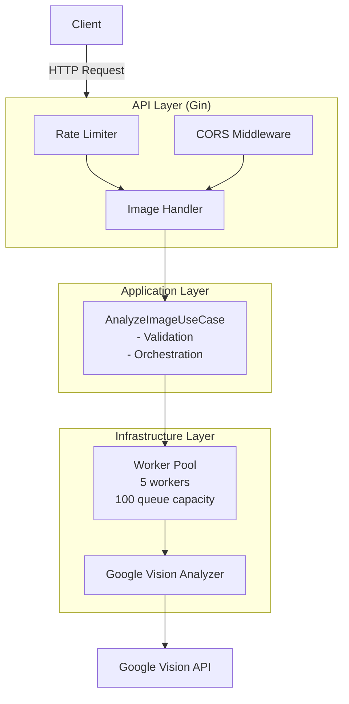
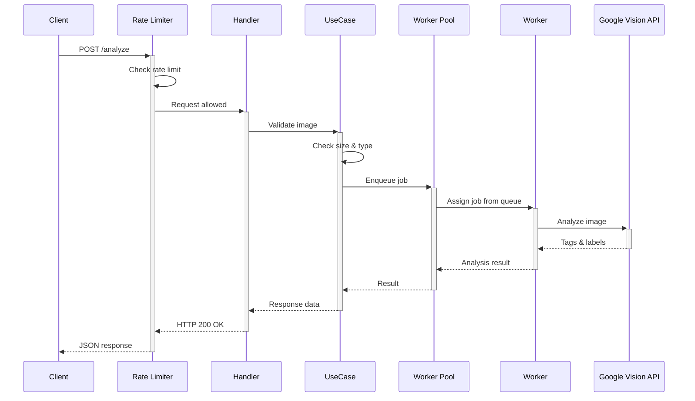

# Image Analyzer API

Backend API for analyzing images using Google Cloud Vision AI. Built with Clean Architecture principles, featuring worker pool pattern for concurrent processing and rate limiting for API protection.

## Architecture Overview



## Request Flow Sequence



## Prerequisites

- Go 1.21 or higher
- Docker & Docker Compose (optional)
- Google Cloud Vision API credentials (required)

## Quick Start

### 1. Google Cloud Vision Setup

1. **Create a Google Cloud Project:**
   - Go to [Google Cloud Console](https://console.cloud.google.com/)
   - Create a new project or select an existing one

2. **Enable the Vision API:**
   - Navigate to "APIs & Services" > "Library"
   - Search for "Cloud Vision API" and enable it

3. **Create Service Account Credentials:**
   - Go to "APIs & Services" > "Credentials"
   - Click "Create Credentials" > "Service Account"
   - Fill in the details and create
   - Go to the service account's "Keys" tab
   - Click "Add Key" > "Create New Key" > "JSON"
   - Download the JSON file

4. **Configure credentials:**
   
   Save the credentials file outside the project:
   
   **Windows:**
   ```powershell
   # Create directory and save file
   mkdir C:\gcp
   # Move downloaded file to: C:\gcp\credentials.json
   
   # Set environment variable
   $env:GOOGLE_APPLICATION_CREDENTIALS="C:\gcp\credentials.json"
   ```
   
   **Mac/Linux:**
   ```bash
   # Create directory and save file
   mkdir -p ~/gcp
   # Move downloaded file to: ~/gcp/credentials.json
   
   # Set environment variable
   export GOOGLE_APPLICATION_CREDENTIALS="$HOME/gcp/credentials.json"
   ```

### 2. Environment Configuration

Create a `.env` file in the project root:

```env
# AI Provider Configuration
AI_PROVIDER=google_vision

# Server Configuration
PORT=8080
ALLOWED_ORIGINS=https://pedro00627.com,https://www.pedro00627.com,https://image-analyzer-ia-web.onrender.com

# File Upload Limits
MAX_FILE_SIZE=10485760
ALLOWED_FILE_TYPES=image/jpeg,image/png,image/gif,image/webp

# Timeout Configuration
AI_SERVICE_TIMEOUT=30s
HTTP_READ_TIMEOUT=10s
HTTP_WRITE_TIMEOUT=10s
HTTP_IDLE_TIMEOUT=60s

# Rate Limiting Configuration
RATE_LIMIT_PER_MINUTE=4
RATE_LIMIT_BURST=4

# Worker Pool Configuration
WORKER_POOL_SIZE=5
WORKER_POOL_QUEUE_SIZE=100
```

**Configuration Details:**

- `WORKER_POOL_SIZE`: Number of concurrent workers processing analysis requests (default: 5)
- `WORKER_POOL_QUEUE_SIZE`: Maximum number of queued jobs waiting for processing (default: 100)
- `RATE_LIMIT_PER_MINUTE`: Maximum requests per IP per minute
- `RATE_LIMIT_BURST`: Maximum burst size for rate limiting

### 3. Run the Application

**Option A: With Docker (Recommended)**
```bash
docker-compose up --build
```

**Option B: Direct with Go**
```bash
go mod download
go run cmd/main.go
```

API will be available at: `http://localhost:8080`

## API Documentation

**Health Check:**
```
GET /health
```

**Analyze Image:**
```
POST /api/analyze
Content-Type: multipart/form-data

Body:
- image: file (JPEG, PNG, GIF, WEBP)

Response:
{
  "success": true,
  "data": {
    "tags": [{"label": "example", "confidence": 0.95}],
    "analyzed_at": "2025-12-22T10:00:00Z"
  }
}
```

## Features

### Core Functionality
- Image analysis using Google Cloud Vision API
- RESTful API with JSON responses
- File validation (size, type, content)
- CORS support for frontend integration
- Health check endpoint

### Performance & Reliability
- **Worker Pool Pattern**: Limits concurrent API calls to prevent overload
  - Configurable pool size (default: 5 workers)
  - Job queue with backpressure (default: 100 capacity)
  - Graceful shutdown with job completion
  
- **Rate Limiting**: IP-based request throttling
  - 4 requests per minute per IP (configurable)
  - Token bucket algorithm with burst support
  
- **Timeouts & Context Management**: 
  - Request-level timeouts
  - AI service timeout protection
  - Context cancellation propagation

### Architecture
- Clean Architecture with clear layer separation
- Domain-driven design principles
- Dependency injection for testability
- Interface-based abstractions

## Worker Pool Details

The application uses a worker pool pattern to manage concurrent requests to the Google Vision API:

### How It Works

1. **Job Queue**: Incoming analysis requests are queued in a buffered channel
2. **Worker Pool**: Fixed number of goroutines process jobs concurrently
3. **Result Channels**: Each request has a private channel for receiving results
4. **Shutdown Signal**: Graceful shutdown using signal channels and WaitGroups

### Benefits

- **Controlled Concurrency**: Prevents overwhelming the external API
- **Rate Limiting**: Natural rate limiting through worker count
- **Backpressure Handling**: Queue acts as a buffer during traffic spikes
- **Resource Management**: Predictable memory and connection usage

### Configuration

```env
WORKER_POOL_SIZE=5           # Number of concurrent workers
WORKER_POOL_QUEUE_SIZE=100   # Maximum queued jobs
```

With 5 workers and a queue of 100:
- Up to 5 requests processed simultaneously
- Up to 100 additional requests can wait in queue
- Request 106+ will block until queue space is available

## API Documentation

**Health Check:**
```http
GET /health

Response: 200 OK
{
  "status": "ok"
}
```

**Analyze Image:**
```http
POST /api/analyze
Content-Type: multipart/form-data

Body:
- image: file (JPEG, PNG, GIF, WEBP, max 10MB)

Response: 200 OK
{
  "success": true,
  "data": {
    "tags": [
      {"label": "cat", "confidence": 0.98},
      {"label": "animal", "confidence": 0.95}
    ],
    "analyzed_at": "2025-12-26T10:00:00Z"
  }
}
```

**Error Response:**
```http
Response: 400 Bad Request
{
  "success": false,
  "error": {
    "code": "invalid_file_type",
    "message": "File type not allowed"
  }
}
```

**Rate Limit Response:**
```http
Response: 429 Too Many Requests
{
  "error": "Rate limit exceeded. Please try again later."
}
```

## Testing

Run all tests:
```bash
go test ./...
```

Run tests with coverage:
```bash
go test -cover ./...
```

Run tests with race detector:
```bash
go test -race ./...
```

Run specific package tests:
```bash
go test ./internal/infrastructure/ai_analyzer/...
```

Generate coverage report:
```bash
go test -coverprofile=coverage.out ./...
go tool cover -html=coverage.out -o coverage.html
```

### Test Coverage

- Worker Pool: 87.3%
- Domain Layer: 100%
- Infrastructure: 87%+
- Application Layer: 100%

## Project Structure

```
.
├── cmd/
│   └── main.go                 # Application entry point
├── internal/
│   ├── api/                    # HTTP layer
│   │   ├── handler/           # Request handlers
│   │   ├── middleware/        # Rate limiter, CORS
│   │   ├── router/            # Route definitions
│   │   └── server/            # HTTP server
│   ├── application/           # Use cases
│   │   ├── service/           # Application services
│   │   └── usecase/           # Business logic orchestration
│   ├── domain/                # Business domain
│   │   ├── entity/            # Domain entities
│   │   ├── error/             # Domain errors
│   │   └── service/           # Domain service interfaces
│   └── infrastructure/        # External concerns
│       ├── ai_analyzer/       # Google Vision integration + Worker Pool
│       ├── bootstrap/         # Dependency injection
│       ├── config/            # Configuration management
│       └── validator/         # File validation
└── test/
    └── integration/           # Integration tests
```

## Performance Considerations

### Worker Pool Tuning

The worker pool size should be tuned based on:
- Expected request volume
- Google Vision API quotas
- Server resources (memory, connections)

**Guidelines:**
- Start with 5 workers for moderate traffic
- Increase to 10-20 for high traffic
- Monitor queue length and adjust accordingly

### Rate Limiting

Protects both your API and the external service:
- Default: 4 requests/minute per IP
- Adjust based on your use case and API quotas
- Consider implementing Redis for distributed rate limiting

## Troubleshooting

**"Rate limit exceeded" errors:**
- Increase `RATE_LIMIT_PER_MINUTE` value
- Implement caching for repeated images
- Use multiple API keys with load balancing

**"Worker pool is shutting down" errors:**
- Check for graceful shutdown issues
- Ensure sufficient shutdown timeout
- Verify no long-running jobs blocking shutdown

**"Context cancelled" errors:**
- Increase `AI_SERVICE_TIMEOUT` value
- Check network latency to Google API
- Verify image size isn't too large

## License

MIT License
